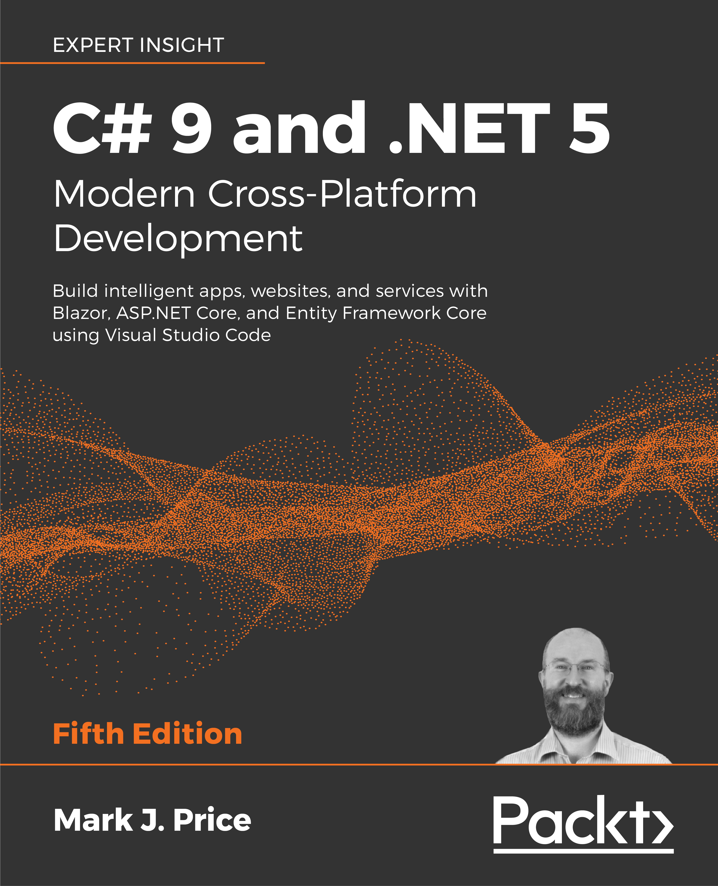

# Repository for the Packt Publishing book

## C# 9 and .NET 5 - Modern Cross-Platform Development, Fifth Edition

Order the book today!
- [Packt](https://www.packtpub.com/product/c-9-and-net-5-modern-cross-platform-development-fifth-edition/9781800568105)
- [Amazon.com](https://www.amazon.com/dp/180056810X/)
- [Amazon.co.uk](https://www.amazon.co.uk/dp/180056810X/)

Author page on Amazon: https://www.amazon.com/Mark-J-Price/e/B071DW3QGN/

## Important
Corrections for typos and other mistakes, and improvements like refactoring code.
- [Improvements & Errata - list of corrections](errata.md)
- [Fifth Edition's support for .NET 6.0](dotnet6.md)
- [Book links](book-links.md)
- [Five Years of Ratings](five-years-of-ratings.md)

## Online materials
Supplementary book materials available to download as PDFs: 
- [Color images](https://static.packt-cdn.com/downloads/9781800568105_ColorImages.pdf) of the screenshots/diagrams used in this book
- [Appendices](https://static.packt-cdn.com/downloads/9781800568105_Appendices.pdf) for this book
  - Appendix A, Answers to the Test Your Knowledge Questions
  - Appendix B, Building Windows Desktop Apps
- The [cs9dotnet5-extras](https://github.com/markjprice/cs9dotnet5-extras) repository contains articles that support the book, for example, instructions for using a Raspberry Pi to complete the coding tasks in the book.

Useful links post-publishing: 
- [Announcing .NET 5.0](https://devblogs.microsoft.com/dotnet/announcing-net-5-0/)
- [Announcing the Release of EF Core 5.0](https://devblogs.microsoft.com/dotnet/announcing-the-release-of-ef-core-5-0/)
- [Announcing ASP.NET Core in .NET 5](https://devblogs.microsoft.com/aspnet/announcing-asp-net-core-in-net-5/)
- [Breaking changes for migration from version 3.1 to 5.0](https://docs.microsoft.com/en-us/dotnet/core/compatibility/3.1-5.0)
- [C# 9.0 on the record](https://devblogs.microsoft.com/dotnet/c-9-0-on-the-record/)
- [.NET 5.0 Examples](https://gist.github.com/richlander/50c34a8714eb3436e5d9d4d5d420776e)

## Interviews with me
Podcast interviews with me:
- [The .NET Core Podcast](https://dotnetcore.show/episode-44-learning-net-core-with-mark-j-price/)
- [Yet Another Podcase with Jesse Liberty - May 2021](http://jesseliberty.com/2021/05/16/mark-price-on-c9-and-net-6/)
- [Yet Another Podcast with Jesse Liberty - February 2020](http://jesseliberty.com/2020/02/23/mark-price-c-net-core/)
- [Packt Podcasts](https://soundcloud.com/packt-podcasts/csharp-8-dotnet-core-3-the-evolution-of-the-microsoft-ecosystem)

Written interviews with me:
- [C# 9 and .NET 5: Book Review and Q&A](https://www.infoq.com/articles/book-interview-mark-price/?itm_source=infoq&itm_campaign=user_page&itm_medium=link)
- [Q&A with Episerver's Mark J. Price, author of C# 9 and .NET 5 - Modern Cross-Platform Development](https://www.episerver.com/articles/q-and-a-with-mark-price)

## Book cover

