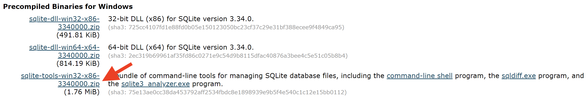
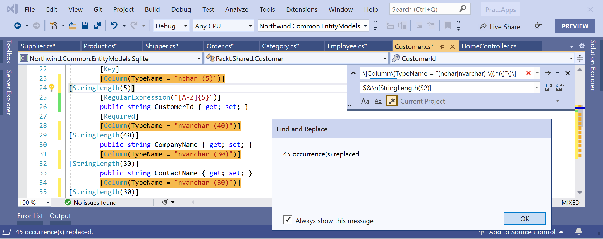

# Errata & Improvements

If you find any mistakes in the fifth edition, C# 9 and .NET 5, or if you have suggestions for improvements, then please raise an issue in this repository or email me at markjprice (at) gmail.com.

## A message from a reader

Hi! This isn't an errata. 

I know that I've submitted a few potential errata, but I just wanted to say that this is one of the most cleanly written programming books I've read in quite a while. The author clearly cares about the quality of his book and takes time to anticipate what a reader might run into. It is a pleasure working through it. Keep up the great work! 

I hope you share this comment with the author to let him know that his work is greatly enjoyed and appreciated.

## Page 13 - Removing old versions of .NET
I wrote that the command to remove all but the latest preview version is:
```
dotnet-core-uninstall --all-previews-but-latest --sdk
```
It should have been:
```
dotnet-core-uninstall remove --all-previews-but-latest --sdk
```

## Page 34 - Discovering your C# compiler versions

In steps 5 and 6, I show the C# compiler (`csc`) command listing the supported language versions on macOS. There is also a note explaining that the `csc` command is not in the default path on Windows so you get an error. So I include a link to a Microsoft article explaining how to fix this. I regret including steps 5 and 6 because they cause some readers problems without adding any real value because the `csc` command is never used again. In the next edition I will remove steps 5 and 6.

## Page 40 - Verbs are methods

In the book I say that the `WriteLine` method outputs a carriage-return, as shown in the following code:
```
// outputs a carriage-return
Console.WriteLine();
```
I should have said that the `WriteLine` method outputs the current line terminator string that by default are two characters, a carriage-return followed by a line feed, as shown in the following code:
```
// outputs the current line terminator string
// by default, this is a carriage-return and line feed
Console.WriteLine();
```

## Page 45 - Understanding verbatim strings

In the book, I say that the code `string filePath = "C:\televisions\sony\bravia.txt";` has the problem that compiler will interpret `\t` as the tab character because it processes `\t` as an escape sequence. 

I should have also pointed out that the `\b` in `\bravia` would be interpreted as a backspace character. 

Also, the compiler would  complain about the `\s` in `\sony` because `\s` is not a valid escape sequence, as shown in the following exception message: `error CS1009: Unrecognized escape sequence`.

You can read more about character escapes, including a list of valid characters, at the following link: 
https://docs.microsoft.com/en-us/dotnet/csharp/programming-guide/strings/#string-escape-sequences

## Page 51 - Comparing double and decimal types

In the book, I say that the `double` type has some special static members, including one named `Infinity`. This is wrong. There are two members named `PositiveInfinity` and `NegativeInfinity`.

## Page 51 - Using Visual Studio Code workspaces

The book says, "Visual Studio has a feature called workspaces that enables this." It should have said, "Visual Studio **Code** has a feature called workspaces that enables this."

## Page 53 - Storing dynamic types

In the code example, I show assigning a `string` value to a dynamically-typed variable, as shown in the following code:
```
// storing a string in a dynamic object
dynamic anotherName = "Ahmed";

// this compiles but would throw an exception at run-time
// if you later store a data type that does not have a 
// property named Length
int length = anotherName.Length;
```

The above example code does not throw an exception because at the time we get the `Length` property, the value stored in `anotherName` is a `string` which does have a `Length` property.

The example would have been clearer if I had shown some examples of assigning values with other data types that do and do not have a `Length` property, as shown in the following code:

```
// storing a string in a dynamic object
// string has a Length property
dynamic anotherName = "Ahmed";

// int does not have a Length property
anotherName = 12;

// an array of any type has a Length property
// anotherName = new[] { 3, 5, 7 };

// this compiles but would throw an exception at run-time
// if you had stored a value with a data type that does not 
// have a property named Length
int length = anotherName.Length;
```

The above example code does throw an exception because at the time we get the `Length` property, the value stored in `anotherName` is an `int` which does not have a `Length` property, as shown in the following output:

```
Unhandled exception. Microsoft.CSharp.RuntimeBinder.RuntimeBinderException: 'int' does not contain a definition for 'Length'
   at CallSite.Target(Closure , CallSite , Object )
   at System.Dynamic.UpdateDelegates.UpdateAndExecute1[T0,TRet](CallSite site, T0 arg0)
   at Variables.Program.Main(String[] args) in /Users/markjprice/Code/Chapter02/Variables/Program.cs:line 34
```

If you uncomment the statement that assigns an array of `int` values, then the code works without throwing an exception because all arrays have a `Length` property.

## Page 69 - Setting options with arguments
In the book, I get you to write code to set the console cursor size to a value passed as the last argument and then I say to enter the following command:
```
dotnet run red yellow 50
```

This will attempt to set the cursor size to 50%.

In the book, I say that "On Linux, this will work correctly. On Windows, this will run, but the cursor will not change size. On macOS, you'll see an unhandled exception." But according to `Console.cs` version 5.0.0.0 `System.Console.CursorSize` throws `System.PlatformNotSupportedException` if the set operation is invoked on an operating system other than Windows. I should have said, "On Windows, this will run, but the cursor will not change size. On other operating systems including macOS and Linux, you'll see an unhandled exception."

In the sixth edition, I will try to find different example code that does something more interesting! ;-)

## Page 83 - Branching with the switch statement
The third bullet point states, "Or they should have no statements (like case 3 in the following code)," 

This is an example of a switch section with multiple case labels. A match on any of the case labels will execute that switch section. A similar code example is on page 113 in the CalculateTax function. 

Some developers call this "fall through" although Microsoft uses the term "fall through" for switch sections with statements that do not explicitly exit and therefore "fall through" to another switch section. "Fall throughs" are not allowed and will generate the compiler error, `CS0163: "Control cannot fall through from one case label (<case label>) to another."`

## Page 94 - Rounding numbers

In Step 1, the code uses `ToInt` as a label for the output. It should use `ToInt32` to match the actual method name. The following code:
```
double[] doubles = new[] 
  { 9.49, 9.5, 9.51, 10.49, 10.5, 10.51 };

foreach (double n in doubles)
{
  WriteLine($"ToInt({n}) is {ToInt32(n)}");
}
```
Should be:
```
double[] doubles = new[] 
  { 9.49, 9.5, 9.51, 10.49, 10.5, 10.51 };

foreach (double n in doubles)
{
  WriteLine($"ToInt32({n}) is {ToInt32(n)}");
}
```
The output shown in Step 2 would then look like the following:
```
ToInt32(9.49) is 9
ToInt32(9.5) is 10
ToInt32(9.51) is 10
ToInt32(10.49) is 10
ToInt32(10.5) is 10
ToInt32(10.51) is 11
```

## Page 113 - Writing a function that returns a value
The `switch case` value of `ME` is commented as Maryland. `ME` is the abbreviation for Maine.

## Pages 120 and 121 - Using lambdas in function implementations
At the bottom of page 120, I list the numbers in the Fibonacci sequence but I wrote the last number as 65 when it should have been 55. I repeat the mistake at the top of page 121. I should have written, 34 + **55**, which is 89.

## Page 134 - Switching trace levels
In Step 14, I wrote "Step **into** the call to the `Bind` method by clicking the Step Into or Step Over buttons or pressing F11 or F10." I should have written, "Step **over** the call to the `Bind` method by clicking the Step Into or Step Over buttons or pressing F11 or F10." In the context of being on an external assembly method call, Step Into has the same affect as Step Over.

## Page 163 - Deconstructing tuples
The code example is about deconstructing tuples into individual parts. It shows that you do not have to return a named tuple because during deconstruction the syntax allows explicit naming of the individual parts, as shown in the following code:

```
public (string, int) GetFruit()
{
  return ("Apples", 5);
}

public (string Name, int Number) GetNamedFruit()
{
  return (Name: "Apples", Number: 5);
}

(string fruitName, int fruitNumber) = bob.GetFruit() // GetNamedFruit would also work but is not necessary

WriteLine($"Deconstructed: {fruitName}, {fruitNumber}");
```

## Page 178 - Init-only properties

In Step 5, the book says to "Comment out the attempt to set the `LastName` property after instantiation." This should have said, "Comment out the attempt to set the `FirstName` property after instantiation."

## Page 180 - Positional records
In Step 1, the code in the book to define a positional record uses the original keywords, `data class`, that were used in early previews of .NET 5, as shown in the following code:
```
// simpler way to define a record that does the equivalent
public data class ImmutableAnimal(string Name, string Species);
```
It should have been updated to use the keyword, `record`, that was used in later previews and the final release of .NET 5, as shown in the following code:
```
// simpler way to define a record that does the equivalent
public record ImmutableAnimal(string Name, string Species);
```
The code in the GitHub repository was already correct. It is only the print book that has this errata.

## Page 196 - Comparing objects when sorting

Step 3 says to "add a colon and enter `IComparable<Person>`". This works if you started a new project in Chapter 6. But if you continued with your project from Chapter 5 then the Person class already has a colon and inherits from `System.Object`. So the instruction in that case should be, "add a comma and enter `IComparable<Person>`", as shown in the following code:
   
```
public class Person : System.Object, IComparable<Person>
```

## Page 210 - Extending classes to add functionality

In Step 2, I should have made it clear that the statements should be written **after** the previous code that calls the `WriteToConsole` method to ensure that your output matches the book on page 211. 

## Page 222 - Exercise 6.3 – Explore topics

The link for Delegates should be: https://docs.microsoft.com/en-us/dotnet/csharp/tour-of-csharp/features#delegates-and-lambda-expressions

## Page 241 - Publishing a single-file app
In the book, I say that to embed the `pdb` file in the `exe` file, add an element to your `csproj` file, as shown in the following code:
```
<DebugType>embed</DebugType>
```
It should have a value of `embedded`, as shown in the following code:
```
<DebugType>embedded</DebugType>
```
In Step 1 at the bottom of the page, I say, "In Visual Studio Code, navigate to TERMINAL, and enter the following command to 
build the release version of the console application for Windows 10:" but the command shown is for macOS (`osx-x64`), as shown in the following command:
```
dotnet publish -c Release -r osx-x64 /p:PublishSingleFile=true
```

## Page 287 - Creating custom attributes

In Step 5, although writing the `FullName` property works and outputs `Packt.Shared.CoderAttribute`, in the output shown in the book I wrote the `Name` property to keep it shorter as `CoderAttribute`. To match the output, change the following code:
```
WriteLine($"Type: {type.FullName}");
```
To:
```
WriteLine($"Type: {type.Name}");
```

## Page 314 - Compressing streams

In Step 2, I say, `GZipSteam`. It should say, `GZipStream`.

## Pages 338 to 340 - Encrypting symmetrically with AES

The code in the book uses 2000 iterations for PBKDF2 to generate a key and initialization vector (IV) for the encryption algorithm. I said that this is "double the recommended salt size and iteration count". I first wrote that code and statement in the fall of 2015 for the first edition and I have neglected to keep it updated. More than five years later, 2000 is not enough! I have updated the project in GitHub to use 50,000 iterations, as shown in the following code:

```
// iterations should be high enough to take at least 100ms to 
// generate a Key and IV on the target machine. 50,000 iterations
// takes 131ms on my 3.3 GHz Dual-Core Intel Core i7 MacBook Pro.
private static readonly int iterations = 50_000;
```

To avoid updating the value every edition, what I will say in the sixth edition is that the best iteration count for PBKDF2 is whatever number takes about 100ms on the target machine. Now that anyone can buy a $699 Apple Mac mini with amazing performance, that recommendation could be closer to a million iterations! And that value will only increase as time passes. 

As I said on page 334, "If security is important to you (and it should be!), then hire an experienced security expert for guidance rather than relying on advice found online." Or in a generalist programming book.

## Page 343 - Hashing with the commonly used SHA256
To make it easier to complete Exercise 10.3, I split the `CheckPassword` method into two overloaded methods, as shown in the following code:
```
// check a user's password that is stored
// in the private static dictionary Users
public static bool CheckPassword(string username, string password)
{
  if (!Users.ContainsKey(username))
  {
    return false;
  }

  var user = Users[username];

  return CheckPassword(username, password, 
    user.Salt, user.SaltedHashedPassword);
}

// check a user's password using salt and hashed password
public static bool CheckPassword(string username, string password, 
  string salt, string hashedPassword)
{
  // re-generate the salted and hashed password 
  var saltedhashedPassword = SaltAndHashPassword(
    password, salt);

  return (saltedhashedPassword == hashedPassword);
}
```

## Page 389 - Logging EF Core

Before Step 5, there is a missing step that should tell you to comment out the `FilteredIncludes` method call in `Main` and uncomment the call to `QueryingProducts`.

## Page 365 - Setting up SQLite for Windows

In Step 3, when downloading SQLite for Windows, make sure to download the tools ZIP not the dll ZIPs, as shown in the following screenshot:



## Page 480 - Manually improving the class-to-table mapping

There are two improvements that can be made to this section.

### Column names and property names

The `Northwind.sql` script that I provide with the fifth edition uses column names like `CategoryID` for primary keys. But the `dotnet-ef` tool wants to use property names like `CategoryId` so it adds a `[Column(Name = "CategoryID")]` attribute to map between them. In the fifth edition, I say to remove those column name mappings and instead change the property names to match the column names. This is a lot of work! Hopefully most readers download the solution classes from this GitHub repository instead. 

For the sixth edition, I modified the SQL script to use columns names like `CategoryId` so that the `dotnet-ef` tool does not need to add those mappings. You can get the improved `Northwind4SQLite.sql` script from the following GitHub repo for the sixth edition: https://github.com/markjprice/cs10dotnet6/tree/main/sql-scripts

### Limiting the length of text values

The `dotnet-ef` tool generates entity classes from a database using the database provider that you specify. The SQL Server database provider respects the length limitations like `nvarchar(30)` and decorates the mapped property with `[StringLength(30)]` but the Sqlite database provider does not. Instead, it stores the information about the length limitations in a `[Column(TypeName = "nvarchar(30)")]` attribute. If you later want ASP.NET Core or mobile or desktop apps to validate the entity models, it can only do so if properties are decorated with validation attributes like `[StringLength]` and `[RegularExpression]`. 

Instead of manually adding `[StringLength]` attributes to match the maximum number of characters that should be stored in text columns, you can use your code editor's find and replace feature with a regular expression that finds all instances of the `[Column]` attribute with either `nchar` or `nvarchar` and then extracts the length value as a reference, as shown in the following search expression:
```
\[Column\(TypeName = "(nchar|nvarchar) \((.*)\)"\)\]
```
Then you can use the following replace expression to add the `[StringLength]` attribute after the `[Column]` attribute with the referenced length:
```
$&\n[StringLength($2)]
```
As an example of this in action, see Visual Studio's find and replace, as shown in the following screenshot:



## Page 514 - Implementing the employees feature using EF Core

In Step 8, in the `employees.cshtml` file, the HTML defines a heading element, as shown in the following markup:
```
<h1 class="display-2">Employees</h2>
```
The end tag should be an h1, as shown in the following markup:
```
<h1 class="display-2">Employees</h1>
```

## Page 549 - Defining a typed view

In Step 3, the code to output the unit price of a product at the bottom of page 549 needs the `Value` property, as shown in the following code:
```
// before
@item.UnitPrice.ToString("C")

// after
@item.UnitPrice.Value.ToString("C")
```
This is required because on page 481, in Step 5, I tell you to change any `money` properties, for example, in Order.cs, to use a nullable `decimal` instead of an array of bytes, as shown in the following code:
```
// before
[Column(TypeName = "money")]
public byte[] Freight { get; set; }

// after
[Column(TypeName = "money")]
public decimal? Freight { get; set; }
```
When I wrote the solution code, I neglected to add the `?` to make the `decimal` property nullable, so later I did not need to use `.Value`.

## Page 566 - Using other project templates

In Step 1, the switch for the `dotnet new` command should be `--list` instead of `--help`.

## Appendix A - Chapter 3 - Question 10

10. What interface must an object implement to be enumerated over by using the `foreach` statement?

Answer: An object must implement the `IEnumerable` interface.

Although an object does not have to formally implement an interface to be enumerable using `foreach`, the question asks "What interface...", so the answer must be the name of an interface. `IEnumerable` is that interface. In the next edition, I will put quote-marks around "implement" so it is clear that it can either formally implement the `IEnumerable` interface or just have matching members.

## Appendix A - Chapter 4 - Question 3

3. In Visual Studio Code, what is the difference between pressing F5; Ctrl or Cmd + F5; Shift + F5; and Ctrl or Cmd + Shift + F5?

"Ctrl or Cmd + F5 saves, compiles, and runs the application with the debugger attached" should be "Ctrl or Cmd + F5 saves, compiles, and runs the application with**out** the debugger attached"
